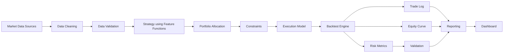
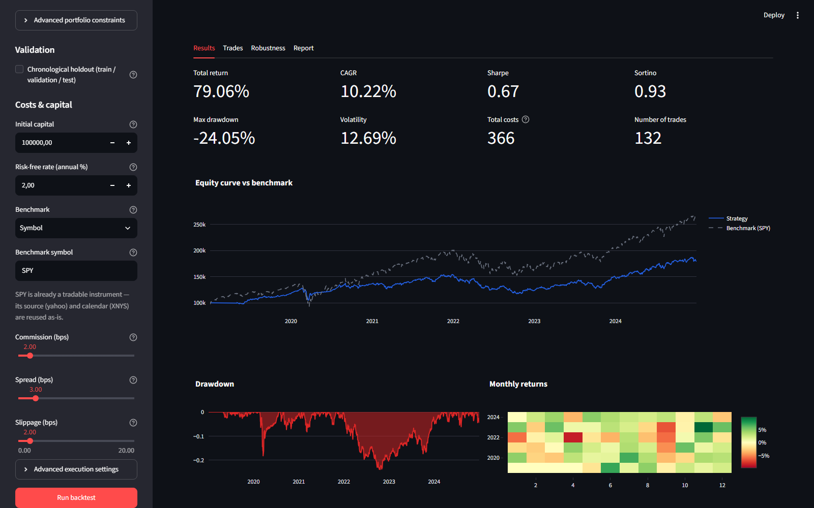
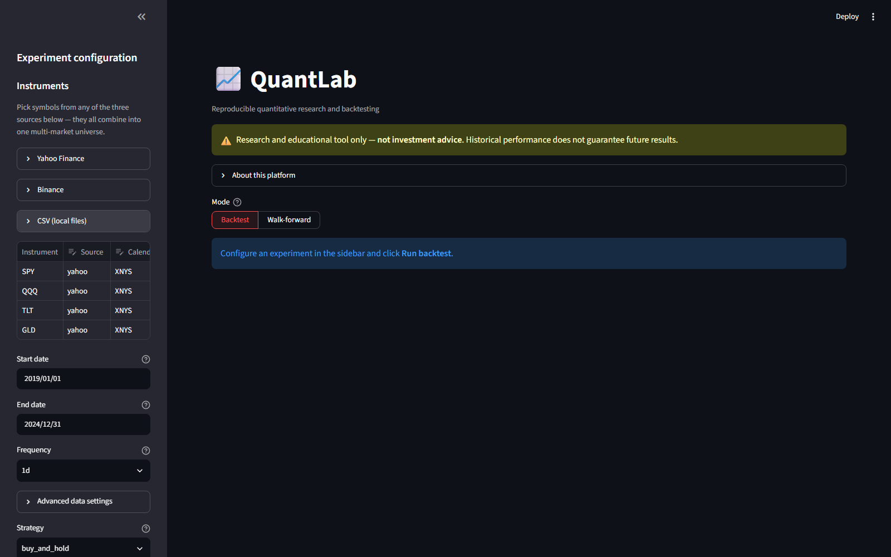

# QuantLab — Reproducible Quantitative Research and Backtesting

QuantLab is a modular Python platform for **quantitative research**: it turns a
financial hypothesis into a reproducible, bias-aware experiment. You download
and validate market data, build features and signals, run vectorised backtests
with realistic costs, measure performance and risk, validate out-of-sample with
walk-forward analysis, and generate an honest research report. A YAML config
drives the core experiment, including an optional walk-forward parameter grid;
separate Python and notebook APIs expose additional robustness analyses such as
sensitivity and bootstrap.

> ⚠️ **This project is for educational and research purposes only.** It is not
> investment advice, and historical performance does not guarantee future
> results.

The goal is **not** to claim a profitable strategy. It is to demonstrate a
rigorous, reproducible research process, designed to prevent common
look-ahead leakage through delayed execution. Custom strategies remain
responsible for causal feature and signal construction.

---

## Features

- **Multiple data sources** — Yahoo Finance (equities/ETFs/indices) and Binance
  (crypto OHLCV), normalised to one canonical schema and cached as Parquet.
- **Reusable strategies** — buy & hold, time-series & cross-sectional momentum,
  mean reversion, trend following, pairs trading — behind one `BaseStrategy`
  interface.
- **Realistic costs** — explicit commission, spread and (constant or
  volume-based) slippage; every result reports **gross vs net**.
- **Delayed-execution barrier** — signals are strictly shifted before returns;
  the separation between *signal at t*, *position at t+1* and *realised
  return* is enforced and unit-tested. This prevents the common look-ahead
  leak of acting on a signal the same period it was formed — a custom
  strategy that reads future rows directly remains responsible for its own
  causal construction.
- **Risk analytics** — Sharpe, Sortino, Calmar, max drawdown, VaR/CVaR,
  exposures, benchmark alpha/beta, and more, implemented from first principles.
- **Walk-forward validation** — expanding/rolling windows, parameter selection
  on validation only and out-of-sample stitching; separate robustness tools
  provide sensitivity heatmaps, bootstrap, permutation and stress tests.
- **Automated reports** — self-contained HTML research report with an honest
  limitations section.
- **Interfaces** — Python API, a Typer CLI, and a Streamlit dashboard.
- **Tested architecture** — unit + integration tests, >80% core-library
  coverage target, Ruff + mypy clean. CLI and dashboard behaviour are exercised
  separately by integration and Streamlit AppTest tests.

---

## Architecture



```
Data → Cleaning & Validation → Feature Functions → Strategy Signals
     → Portfolio Allocation → Execution Costs → Backtest Accounting
     → Risk & Performance → Validation & Reporting
```

---

## Installation

QuantLab supports Python 3.12 and 3.13, the two versions exercised by CI.

```bash
git clone https://github.com/sefaav/QuantLab.git
cd QuantLab

# Linux / macOS
python -m venv .venv
source .venv/bin/activate

# Windows (PowerShell)
python -m venv .venv
.venv\Scripts\Activate.ps1

pip install -e ".[dev,dashboard,yahoo,extra,docs,notebooks]"
```

---

## Quick start (Python API)

Fully self-contained — runs offline against the synthetic demo data already
committed under `data/raw/` (no network access needed):

```python
from quantlab.config import ExperimentConfig
from quantlab.data.loader import DataLoader
from quantlab.strategies.momentum import CrossSectionalMomentumStrategy
from quantlab.portfolio.allocator import InverseVolatilityAllocator
from quantlab.execution.execution_model import ExecutionModel
from quantlab.backtesting.engine import BacktestEngine

config = ExperimentConfig.from_yaml("configs/demo_offline.yaml")
data, _report = DataLoader().load(config)  # loads data/raw/{SPY,QQQ,TLT,GLD}.csv

strategy = CrossSectionalMomentumStrategy(
    lookback_period=189,
    skip_period=21,
    top_fraction=0.5,
    long_short=False,
)
allocator = InverseVolatilityAllocator(volatility_window=63, maximum_weight=0.60)

result = BacktestEngine().run(
    data=data,  # canonical long OHLCV frame
    strategy=strategy,
    allocator=allocator,
    execution_model=ExecutionModel.from_config(config.execution),
    config=config,
)

print(result.summary())
result.to_html("reports/generated/demo/report.html")
```

To run the same experiment on real Yahoo Finance / Binance data instead, swap
in `configs/momentum_sp500.yaml` (or another shipped config) after making its
remote data available with `quantlab download --config
configs/momentum_sp500.yaml`; that command reuses a valid local cache when one
already covers the requested period.

---

## Command-line interface

```bash
quantlab download          --config configs/momentum_sp500.yaml
quantlab backtest          --config configs/momentum_sp500.yaml
quantlab walk-forward      --config configs/momentum_sp500.yaml
quantlab stress-test       --config configs/momentum_sp500.yaml
quantlab bootstrap         --config configs/momentum_sp500.yaml
quantlab permutation-test  --config configs/momentum_sp500.yaml
quantlab sensitivity       --config configs/momentum_sp500.yaml
quantlab robustness        --config configs/momentum_sp500.yaml
quantlab report            --experiment cross_sectional_momentum_etfs
quantlab dashboard
quantlab --help
```

`stress-test`/`bootstrap`/`permutation-test`/`sensitivity` each run one
robustness technique (with a matching `--n-iterations`/`--block-size`/
`--param-x` etc. override); `robustness` runs every technique enabled under
a config's `robustness:` block in one pass. All five branch on
`validation.method`: with `walk_forward`, each starts from the same
walk-forward-stitched out-of-sample result rather than a single backtest, so
the evidence never silently comes from a different validation method than
the one configured. `stress-test` and `sensitivity` re-run the whole
walk-forward selection process per scenario/candidate, since each one
represents a different cost/methodology assumption or parameter to
re-optimise under. `bootstrap` and `permutation-test` do not: they resample
or permute the walk-forward's already-realised out-of-sample return series
statistically, without re-running the selection process itself.

`walk-forward`, `stress-test`, `sensitivity` and `robustness` show a live
progress bar with an ETA in the terminal, and checkpoint their progress to
disk as they go — an interruption (Ctrl+C, a crash, closing the terminal)
resumes automatically on the next matching run instead of starting over.
Pass `--fresh` to discard a checkpoint and start clean.

Each backtest, walk-forward or report run writes a structured artefact
folder under the generated-reports directory. In a source checkout this is
`reports/generated/<experiment>/`; after a regular package installation it is
`~/.quantlab/reports/generated/<experiment>/`. The folder contains the config
snapshot, metrics, equity curve, trades, positions, figures, HTML report, data
hash, best-effort Git state and installed dependency versions. Combined with
the pinned `uv.lock` (restored without modification by `uv sync --locked`),
these artefacts detect input, code and dependency changes, but do not capture
the complete operating-system environment (see `docs/limitations.md`).

---

## Notebooks

Five executed research notebooks under [`notebooks/`](notebooks/), run for
real against cached Yahoo/Binance data (not hand-written pseudocode):

1. [`01_data_quality.ipynb`](notebooks/01_data_quality.ipynb) — coverage, gaps, return sanity checks.
2. [`02_momentum_research.ipynb`](notebooks/02_momentum_research.ipynb) — a full study end-to-end, including walk-forward.
3. [`03_mean_reversion_research.ipynb`](notebooks/03_mean_reversion_research.ipynb) — RSI vs Bollinger vs z-score.
4. [`04_pairs_trading_research.ipynb`](notebooks/04_pairs_trading_research.ipynb) — hedge ratio, ADF test, spread trading.
5. [`05_robustness_analysis.ipynb`](notebooks/05_robustness_analysis.ipynb) — sensitivity heatmap, bootstrap, stress tests, permutation test.

Regenerate them (after `quantlab download` for each config) with
`python scripts/build_notebooks.py`.

---

## Dashboard

```bash
streamlit run src/quantlab/dashboard/app.py
```

A **Backtest** / **Walk-forward** mode switch sits above the sidebar.
Walk-forward mode runs the same train/validation/test parameter selection as
`quantlab walk-forward`, with its own sidebar (windows, expanding mode,
optimization metric, parameter-grid picker) and Results/Trades/Robustness/
Report tabs built from the stitched out-of-sample result, driven by a live
progress bar with an ETA while a run is in flight. Both modes' Robustness
tab includes stress tests, block bootstrap, a Monte Carlo permutation test
and a 2-parameter sensitivity heatmap,
individually or via "Run all robustness tests" — in Walk-forward mode,
stress tests and sensitivity re-run the whole selection process per
scenario/cell rather than a single backtest.



<details>
<summary>Home / configuration screen</summary>



</details>

---

## Tests & quality

The direct commands work in PowerShell, Linux and macOS:

```bash
python -m pytest -m "not network"
python -m pytest -m "not network" --cov=quantlab --cov-report=term-missing
python -m ruff check src tests scripts
python -m ruff format --check src tests scripts
python -m mypy src tests scripts
```

GNU Make is optional. When it is installed, `make test`, `make coverage`,
`make lint` and `make type-check` call the same tools.

---

## Example research

**Robust Cross-Sectional Momentum Across Liquid Multi-Asset ETFs** —
Can cross-sectional momentum generate stable out-of-sample risk-adjusted
returns across liquid ETFs after transaction costs and volatility targeting?
One example of the kind of study the platform is built for; walk through it in
[`notebooks/02_momentum_research.ipynb`](notebooks/02_momentum_research.ipynb)
and [`notebooks/05_robustness_analysis.ipynb`](notebooks/05_robustness_analysis.ipynb).

`reports/generated/` is a build artefact, deliberately excluded from version
control (see `.gitignore`) — the full HTML report at
`reports/generated/cross_sectional_momentum_etfs/report.html` is **not**
checked into this repository and will not exist until you generate it
yourself:

```bash
quantlab walk-forward --config configs/momentum_sp500.yaml
```

Use `walk-forward`, not `quantlab backtest` — the latter deliberately clears
the walk-forward CSVs and out-of-sample metrics this report includes. This
produces the full 26-fold report the numbers below are drawn from.

## Results

Real, non-cherry-picked results from real Yahoo Finance / Binance data (2008–2025
for ETFs, 2018–2025 for BTC), net of modelled transaction costs:

| Experiment | Universe | Period | CAGR | Sharpe | Max DD | Trades |
| --- | --- | --- | --- | --- | --- | --- |
| Cross-sectional momentum (example above) | 8 multi-asset ETFs | 2008–2025 | 5.7% | 0.44 | −15.8% | 277 |
| ↳ walk-forward out-of-sample | same | 26 folds | 4.7% | 0.32 | −18.5% | — |
| Mean reversion (z-score) | 5 equity ETFs | 2010–2025 | 4.4% | 0.25 | −34.6% | 1,180 |
| Pairs trading (EWA/EWC, vs SPY) | 2 country ETFs | 2010–2025 | 0.9% | −0.35 | −8.0% | 1,314 |
| Trend following (BTC) | BTCUSDT | 2018–2025 | 30.3% | 0.93 | −43.9% | 1,560 |

Every number above — including the negative Sharpe on the pairs trade — is
reported as computed; nothing here is filtered for looking good. **These are
historical and conditional**: they depend on the period, the assumptions, the
cost model, the parameters, and data quality. They are not predictions. See
each report's *Limitations* section and [`docs/limitations.md`](docs/limitations.md).

## Limitations

Adjusted prices, potential survivorship bias (current-composition universes),
no real market impact, simplified slippage, no taxes or regulatory constraints,
simplified liquidity, possible data-snooping, and non-predictive historical
results. These are documented in [`docs/limitations.md`](docs/limitations.md)
and emitted automatically into every report.

## Feedback and bug reports

Found a bug, have a question, or want to suggest an improvement? Please
[open an issue](https://github.com/sefaav/QuantLab/issues) on GitHub —
feedback and bug reports are always welcome.

## Disclaimer

This project is intended for educational and research purposes only. It does not
constitute investment advice, and historical performance does not guarantee
future results.

## Author

Built by [sefaav](https://sefaav.github.io/website/index.html).
Find more projects on [GitHub](https://github.com/sefaav).

## License

MIT — see [LICENSE](LICENSE).
