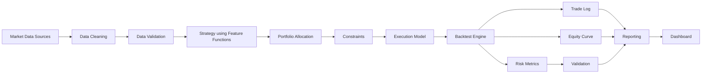

# Architecture

## Pipeline

QuantLab enforces an ordered backtest pipeline with independently testable
responsibilities. Strategies may call feature functions directly or use the
optional `FeaturePipeline` helper; the engine does not require that helper.



## Package layout

```
src/quantlab/
├── cli.py                 # Typer CLI (download / backtest / walk-forward / report / dashboard)
├── config.py              # Pydantic ExperimentConfig (loaded from YAML)
├── constants.py           # Canonical schema, annualisation factors, paths
├── exceptions.py          # QuantLabError hierarchy
├── logging_config.py      # Standard-library logging setup
│
├── data/                  # Sources, cleaning, validation, Parquet storage, universes
├── features/              # Returns, momentum, volatility, mean reversion, cross-sectional, pipeline
├── strategies/            # BaseStrategy + concrete strategies (signals only)
├── portfolio/             # Allocators, constraints, rebalancing, volatility targeting
├── execution/             # Commission, spread, slippage models
├── backtesting/           # Engine, accounting, trade log, benchmark, result
├── risk/                  # Performance & risk metrics, drawdown, VaR/CVaR, exposure, stress
├── validation/            # Chronological splits, walk-forward, sensitivity, bootstrap, robustness
├── reporting/             # Charts, tables, HTML report, research narrative
└── dashboard/             # Streamlit app
```

## Why this separation

- **Strategies emit signals only** (`[-1, 1]` per asset per date). They never
  compute weights, costs, or returns. This makes each strategy trivially
  unit-testable against a synthetic dataset with an obvious expected signal.
- **Allocators turn signals into weights** and know nothing about execution
  costs or accounting.
- **The execution model computes costs** from weight *changes*, independent of
  which strategy or allocator produced them.
- **Signals, weights, costs and returns are combined in one fixed order**,
  with the weight-shift step as a hard, tested barrier against look-ahead
  bias. `BacktestEngine.run()` is that assembly for a single backtest.
  `WalkForwardValidator._build_oos_result()` (`quantlab.validation.
  walk_forward`) independently assembles the same stitched-OOS-series case,
  reusing the same underlying accounting/trade-log/benchmark/metrics
  functions in the same order rather than calling `BacktestEngine.run()`
  itself — a fix that touches how that assembly step works (e.g. which
  execution-model fields the trade log or metadata reads) currently needs
  applying at both call sites, not one shared entry point.

## Data flow shapes

- **Long format** (`timestamp, symbol, open, high, low, close,
  adjusted_close, volume`) is the canonical on-disk/interchange format.
- **Wide format** (`index=dates, columns=symbols`) is what features,
  strategies and the engine operate on internally, built via
  `quantlab.data.base.pivot_field`.
